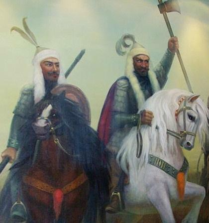

# 1-0523-刘洋-修改测试

                                                         **The Valiant Jurchen People**

| 1115年 | 完颜阿骨打统一女真各部，建立金 |
| --- | --- | --- |
| 1615年 | 女真首领努尔哈赤在新宾县二道河子畔的 赫图阿拉城称汗建国 |
| 1644年 | 满洲（女真）入主中原，建立清朝。为中国最后一个大一统王朝。 |

        The Jurchens originally inhabited the northeast regions of China. ****Their sudden rise in the twelfth century had a considerable impact on the situation in the northern parts of the country. However, the Jin dynasty established by the Jurchen perished at the attack of Mongol hordes and the Jurchens were forced to return to their primitive tribe life. For a very long period this group remained unnoticed till Nurhaci united the Jurchen tribes and the valiant Jurchens once again came to rise. The Ming Empire was undergoing the post-prosperous decline back then, struggling with all kinds of social ills and conflicts. Under such circumstances the Jurchen could be fairly considered as a leader that was coming backing to the arena of history.

        What was the ethnic group like? And what kind of people were they? What had it undergone between the rise and fall and how could they manage to rise twice in history and?

        The Jurchen was one of the most ancient ethnic groups of China, with a long history that could be dated back to Sushen, an ethnic group active during the Xia, Shang and Zhou Dynasties thousands of years ago. This group then evolved along with the growth of China, and its name had changed from Yilou in Qin-Han period to Moji in Wei, Jin and Southern& Northern period, followed by Mohe in Sui, Tang and Five Dynasties and finally to Jurchen during the epoch of the Song and Yuan Dynasties. It was also in the epoch of Song-Yuan that the Jurchen became much more powerful after a long-term development and established the Jin Dynasty by conquering many of the tribes. Although the Jin Dynasty was destroyed by the Mongol hordes at last, the Jurchen could not possibly be forgotten since it had established a dynasty in its debut in the arena of history. 

        The Jurchens were divided into three groups in the early period of the Ming Dynasty and the three groups were: the Jianzhou Jurchens, inhabited the area stretching from the east boarder of Fushun to the east and north of the Changbai Mountain and the north of the Yalu river; the Haixi Jurchens, inhabited the area stretching from the north border of Kaiyuan, Liaoning to the great turn of the midstream of Songhua River; the Wild Jurchens, inhabited around the midstream of the Songhua River and Heilong River. Jianzhou Jurchens, being near to the Weisuos \(which as a term would be explained later\) of Liaodong and greatly influenced by the culture and economy of the Han people, became the most advanced group of the three. And like many of the empires in the central plain, Jianzhou Jurchen had its own myth about its origin. And the myth goes like this: once there was a fairy named Forcuren. One day, when she was bathing in the lake located in northeast Changbai Mountain, she got pregnant after eating a red fruit brought by a divine bird. Later she gave birth to a boy, and the boy was considered the ancestor of Manchuria. The myth showed the unusual origin of Jianzhou Jurchen, and manifested to the world its heaven-driven ambition to rise as a magnificent power.

        The Ming government had perceived the ever expanding ambition of the Jurchens, which was now dominating the northeast China. The government decided to reinforce its jurisdiction over the Jurchens by introducing the system of ruling by Jimi Weisuo instead of declaring war against them. The so-call _Jimi Weisuo system_ works like this: the Ming government made the chieftains of the Jurchen settlements governor, commander, district head and such, and gave them official seal. These chieftains led the Weisuo respectively and paid tribute to the imperial court regularly. Weisuo referred to military unit: Wei and Suo were two different units and each contained different numbers of people. The most influential one of all the Jimi Wuisuos was Jianzhou Three Wei. The chieftain of Jianzhou Jurchens, Ahucu was appointed commander of Jianzhou Wei, and another chieftain Möngke Temür became the leader of Jianzhou Left Wei. There was a general and continuous immigration south of the Jianzhou Jurchens afterwards. When they finally settled down in Hetuala, now the Xinbin County in Liaoning province, the Ming government established a Jianzhou Right Wei among Jianzhou Left Wei. The two, along with Jianzhou Wei, were called “**Jianzhou Three Wei**”. And the area they all shared—the basin of Suzi River, became the cradleland of the Qing dynasty.

